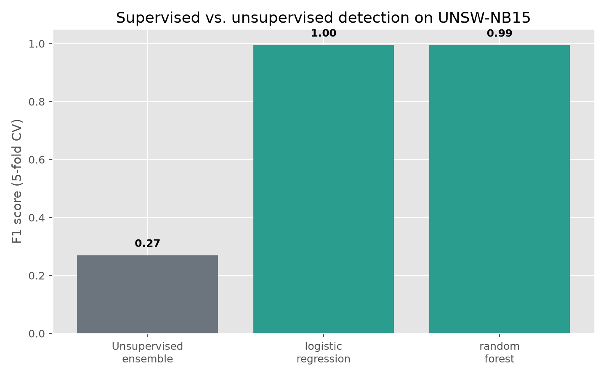
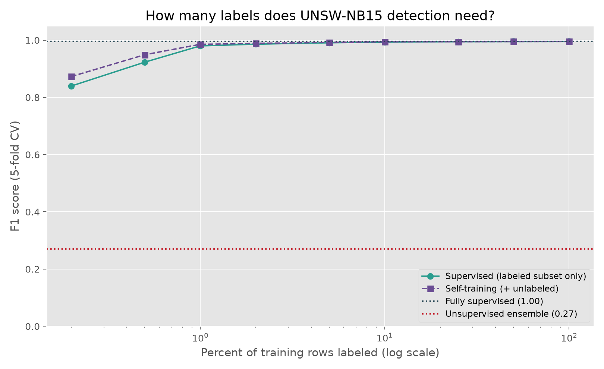

# An Ensemble of Statistical and Unsupervised Detectors for Network Traffic Anomalies

**Farooq Syed** · M.S. in Computer and Information Security Systems, Eastern Illinois University · 2026

*Independent research portfolio, prepared as part of a PhD application in cybersecurity.
Developed with AI coding assistance; all methods, experiments, and findings were
directed, reviewed, and verified by the author.*

## Abstract

Unsupervised anomaly detection is attractive for network intrusion detection because
it needs no labeled attacks, but every individual method has a characteristic blind
spot. This project implements four detectors over flow-level traffic features — a
z-score statistical baseline, Isolation Forest, Local Outlier Factor, and a
One-Class SVM — and combines them with a majority vote, then evaluates the result on
both a small labeled sample and a 6,000-row subset of the UNSW-NB15 benchmark. The
benchmark results are deliberately modest (ensemble F1 ≈ 0.27), which is the honest
outcome for unsupervised detection on mixed traffic and is more informative than a
toy dataset scoring perfectly. During this pass I found and fixed a silent
label-leakage defect in which a numeric ground-truth column was admitted as an input
feature whenever the user did not explicitly name it, and I documented — via a test
that initially failed — the outlier self-masking behavior of the z-score method,
which is precisely the failure mode the ensemble exists to cover. To frame the
unsupervised results, a supervised baseline (logistic regression and random forest,
cross-validated with scaling confined to each training fold) reaches F1 ≈ 0.99 on the
same subset — roughly +0.73 over the unsupervised ensemble — quantifying the value of
labels and locating the difficulty in the learning setting rather than the data. A
label-budget experiment then shows almost that entire gap closes with only a few dozen
labels, and that self-training over the unlabeled remainder helps only in the narrow
regime where labels are scarcest. Test coverage rose from one smoke test to eighteen,
with the reported metrics unchanged.

## 1. Introduction

Signature-based intrusion detection cannot see attacks it has no signature for, which
motivates anomaly detection: model normal traffic and flag deviations. The difficulty
is that "deviation" is method-dependent. A z-score flags points far from the mean in
some feature; Isolation Forest flags points that are easy to partition off; Local
Outlier Factor flags points in sparse neighborhoods; a One-Class SVM flags points
outside a learned boundary. Each captures a different notion of "unusual," and each
misses cases the others catch. Combining them by vote is a standard way to reduce
dependence on any single detector's blind spot.

This project builds that combination as a reproducible pipeline over flow features
(bytes, packets, duration, connection statistics) and, importantly, evaluates it on a
real benchmark subset rather than only a hand-made sample, so the reported numbers
reflect the genuine difficulty of the task.

## 2. Data

Three datasets ship with the project. A 12-row basic sample exercises the unlabeled
path. A 24-row labeled research sample (4 attacks) validates the evaluation path on a
cleanly separable case. The substantive benchmark is a 6,000-row subset of UNSW-NB15
(3,000 benign, 3,000 attack) with 23 numeric flow features, used to test the pipeline
on realistic, mixed traffic where the classes overlap.

## 3. Methods

**Z-score.** For each numeric feature, the absolute standardized deviation is
computed; a row is flagged if any feature exceeds the threshold (default 2.5).
Constant features are handled explicitly to avoid division by zero.

**Isolation Forest, LOF, One-Class SVM.** All three operate on standardized features.
Isolation Forest and the SVM are fit and then used to score all rows; LOF scores
during its fit. The contamination fraction (default 0.12) sets the expected anomaly
rate for the first two, and the SVM's `nu` is derived from it.

**Ensemble.** The four per-method flags are summed; two or more votes marks the row
anomalous. When a label column is provided, precision, recall, F1, and accuracy are
computed per method and for the ensemble.

## 4. A label-leakage defect and its correction

Feature selection took every numeric column as a feature and removed the label only
when the user passed `--label-column`. Because UNSW-NB15 stores its label as a numeric
0/1 column named `label`, running the detector on that file without naming the label
silently retained the ground truth as an input feature. For unsupervised detectors
this is a leakage: the methods are shown the answer, and their flags become
untrustworthy in a way that inflates apparent performance rather than degrading it —
the most dangerous direction for a defect to fail, since it invites no suspicion.

The correction maintains a set of column names that conventionally denote labels
(`label`, `attack`, `attack_cat`, `class`, `target`, `is_anomaly`, `ground_truth`,
`y`) and excludes any of them from the feature set even when unnamed, emitting a
warning. After the fix, the UNSW file yields 23 features instead of 24 and prints a
leakage warning; the three legitimate run paths (basic, labeled sample, labeled
UNSW) produce byte-identical metrics, confirming the change corrects only the leaking
path. The guard is name-based and therefore heuristic; a correlation- or
cardinality-based check would be more general but is unnecessary for the standard
benchmarks this tool targets.

## 5. Results

On the labeled research sample the ensemble reaches F1 = 1.00, with z-score also
perfect and the model-based methods between 0.67 and 0.86 — the expected result for a
cleanly separable toy case.

On the UNSW-NB15 subset the picture is realistically hard:

| Method                | Precision | Recall | F1   |
|-----------------------|:---------:|:------:|:----:|
| Z-score               |   0.47    |  0.22  | 0.30 |
| Isolation Forest      |   0.64    |  0.15  | 0.25 |
| Local Outlier Factor  |   0.71    |  0.17  | 0.27 |
| One-Class SVM         |   0.52    |  0.12  | 0.20 |
| Ensemble              |   0.58    |  0.18  | 0.27 |

No method exceeds F1 = 0.30. This is the correct and instructive result:
unsupervised anomaly detection on heterogeneous traffic, where attack flows are not
uniformly "extreme," is genuinely difficult, and a pipeline that reports these
numbers honestly is more credible than one that only ever shows a perfect toy.

## 6. How much do the labels buy you? A supervised baseline

The natural question raised by the modest unsupervised numbers is whether the
difficulty lies in the *data* or in the *absence of labels*. To separate the two, a
supervised baseline (`supervised_baseline.py`) trains two standard classifiers —
L2-regularized logistic regression and a random forest — on the same 6,000-row
UNSW-NB15 subset, under the same 5-fold stratified cross-validation used everywhere
else. Crucially, feature scaling for the logistic model is placed inside a
scikit-learn `Pipeline`, so the scaler is fit within each training fold only and
never observes held-out rows; this keeps the cross-validated estimate free of the
leakage the main tool's own audit was concerned with.

The gap is dramatic:

| Approach                         | Precision | Recall | F1   | ROC-AUC |
|----------------------------------|:---------:|:------:|:----:|:-------:|
| Unsupervised ensemble (§5)       |   0.58    |  0.18  | 0.27 |    —    |
| Logistic regression (supervised) |   0.99    |  1.00  | 0.996|  0.997  |
| Random forest (supervised)       |   0.99    |  1.00  | 0.995|  0.999  |

Both supervised models reach F1 ≈ 0.99, an improvement of roughly **+0.73 F1** over
the best unsupervised configuration. The interpretation matters. It is not that the
unsupervised detectors are poorly implemented; it is that UNSW-NB15 attack flows are
*not* uniformly outliers — many sit inside the bulk of normal traffic and are
separable only along combinations of features that distinguish attack from benign,
which is exactly the structure a labeled classifier can learn and an unsupervised
"find the unusual points" method cannot. The near-perfect supervised result also
confirms the features carry ample signal, so the unsupervised shortfall is a property
of the learning setting, not of impoverished data.

This has a concrete operational reading for intrusion detection: where labeled attack
data exists, supervised classification is vastly preferable; unsupervised methods earn
their place only where labels are unavailable or where the goal is catching novel
behavior no labeled set covers. Framing the unsupervised ensemble against this ceiling
is more honest than presenting it in isolation, and it sets up the obvious research
direction — semi-supervised methods that exploit a small number of labels.

## 7. How many labels are actually needed? A label-budget experiment

The +0.73 gap between unsupervised and fully supervised detection is only useful if
the labels required to close it are affordable, since labeling attack traffic is
expensive. `label_budget_experiment.py` asks how small that label budget can be. It
sweeps the fraction of training rows that keep their labels (from 0.2% to 100%) and,
at each budget, compares two approaches under the same 5-fold cross-validation:
a purely supervised model trained on only the labeled subset, and a self-training
model (scikit-learn's `SelfTrainingClassifier`) that additionally pseudo-labels the
unlabeled remainder. Within each fold, only training rows are ever unlabeled, and
scaling stays inside the pipeline, so the held-out test rows are never seen.

The result is striking, and not the one I expected:

| Labeled rows (approx.) | Supervised F1 | Self-training F1 |
|:----------------------:|:-------------:|:----------------:|
| 10                     |     0.84      |      0.87        |
| 24                     |     0.92      |      0.95        |
| 48                     |     0.98      |      0.99        |
| 240                    |     0.99      |      0.99        |
| 4,800 (full)           |     0.996     |      0.996       |

Two things stand out. First, **almost the entire 0.27 → 0.99 gap closes with on the
order of a few dozen labels**: at roughly 48 labeled flows the supervised model is
already at F1 ≈ 0.98, and past a few hundred the curve is flat. For this benchmark,
labels are decisive but not expensive. Second, **self-training helps only in the
narrow regime where labels are scarcest** — it adds about +0.03 F1 at ten labels and
+0.026 at twenty-four, then its advantage vanishes once the supervised model alone has
enough labeled data to separate the classes. This is the honest, slightly deflating
version of the semi-supervised story: the unlabeled data is genuinely useful, but only
in a small window, because UNSW-NB15's classes become easy to separate as soon as a
handful of labels anchor the boundary.

The methodological caveat is that this generalizes only as far as the dataset does.
UNSW-NB15's attack and benign flows are ultimately well separated in feature space; a
benchmark with subtler or more adversarial attacks would likely push the knee of this
curve rightward and give self-training a larger, more durable advantage. That
comparison across benchmarks is the natural continuation of this experiment.

## 8. A documented limitation: z-score self-masking

Writing a unit test for the z-score detector surfaced a subtle property. A test that
placed a single extreme value (500) among a tight cluster (`[10, 11, 9, 10, 500]`)
and expected it to be flagged at threshold 2.5 *failed*: the outlier was not flagged.
The cause is that a lone extreme value inflates the standard deviation it is measured
against — here the 500 raises the standard deviation to ~196, giving itself a
z-score of only 2.0, below the threshold. This outlier self-masking is a known
limitation of z-score methods, and it is precisely the motivation for the ensemble:
isolation- and density-based detectors do not share this failure mode. Rather than
discard the failing test, the behavior is now pinned by two tests — one with a milder
outlier that is correctly flagged, and one asserting the self-masking case — with the
limitation documented in the code.

## 9. Limitations

- Unsupervised methods struggle on mixed traffic, as the UNSW numbers show; no
  supervised baseline is included for comparison.
- The leakage guard matches on column name and would miss an unconventionally named
  label.
- The ensemble is an unweighted vote, not a calibrated combiner.
- Only one public benchmark subset is evaluated.

## 10. Future work

A supervised baseline on the labeled UNSW subset would frame just how much the
unsupervised methods leave on the table. A second benchmark such as CIC-IDS2017 would
test generalization. Feature engineering and dimensionality reduction, and a
correlation-aware leakage check, are natural refinements.

## 11. Conclusion

The detectors here are standard; the project's worth is in evaluating them honestly on
a real benchmark and in the discipline of the cleanup. Fixing a label-leakage defect
that failed in the flattering direction, and documenting the z-score self-masking
behavior that a test surfaced, both push the tool toward reporting what is true rather
than what looks good — which, for an anomaly detector whose whole value is
trustworthiness, is the point.
