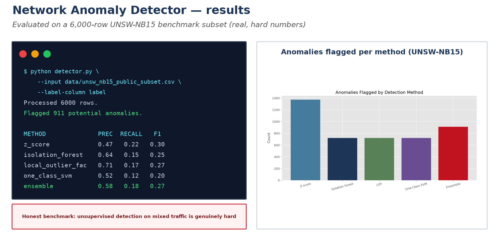
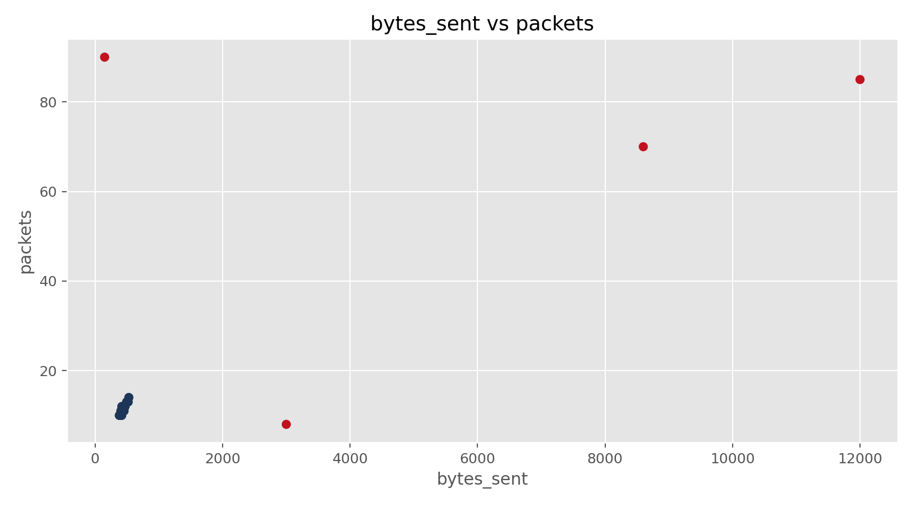
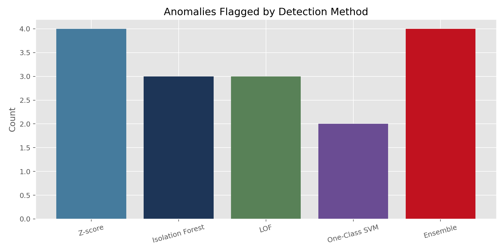
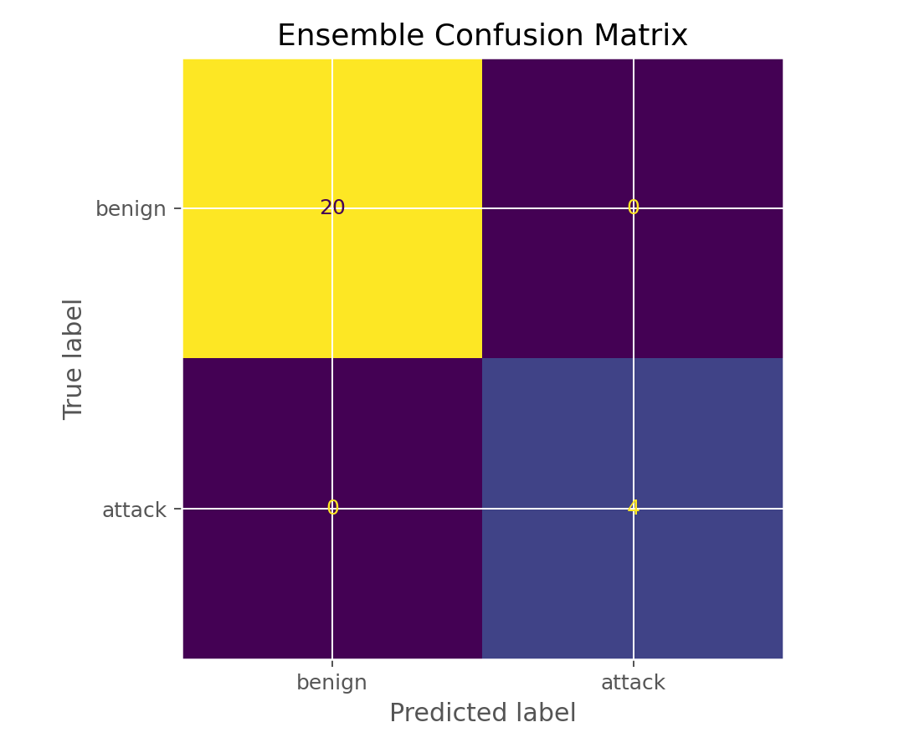
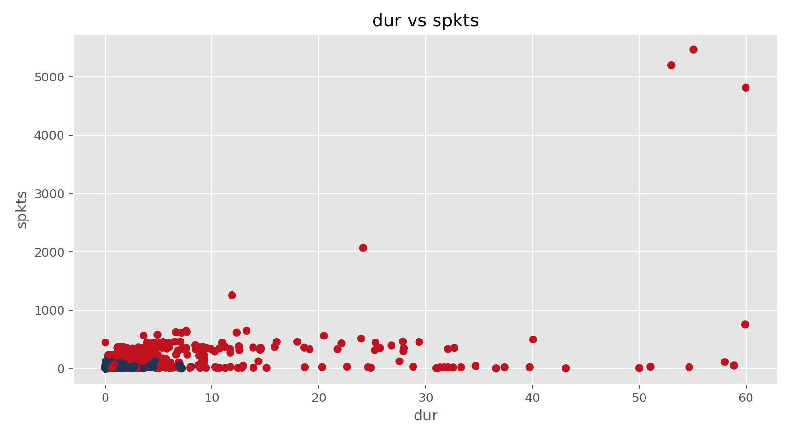
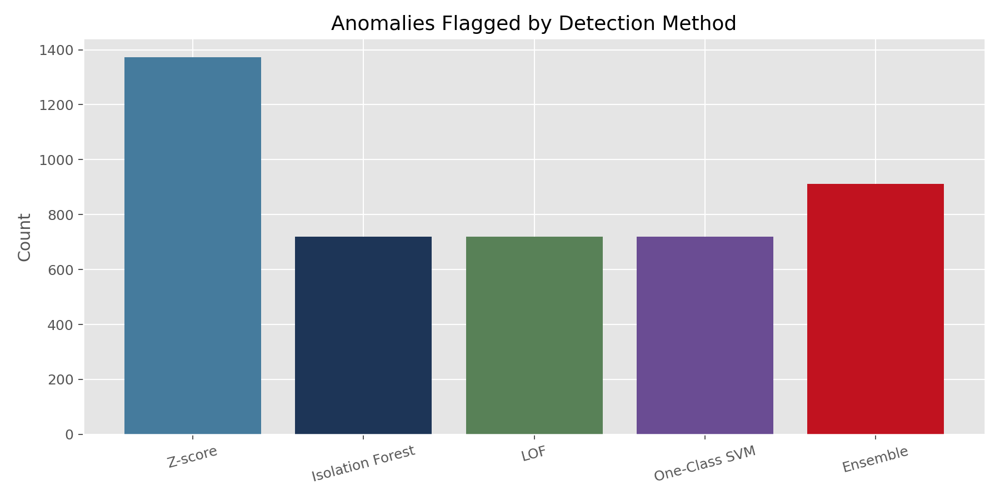
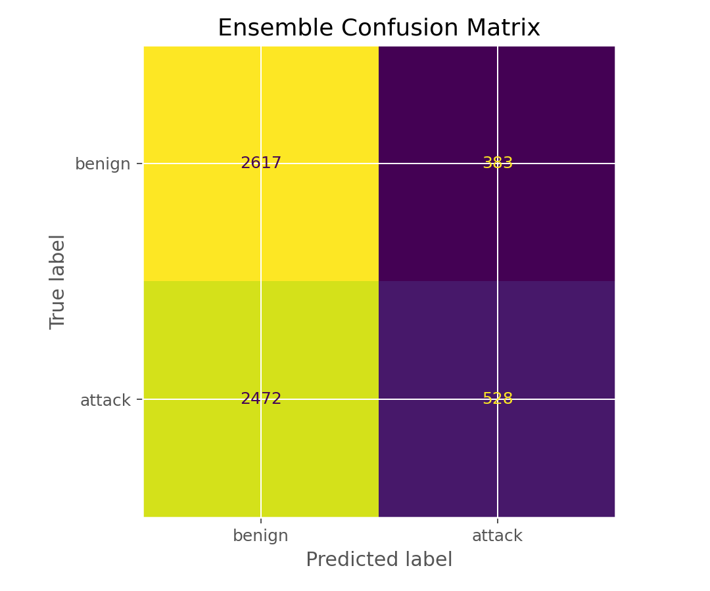

# Python-Based Network Anomaly Detector

[](https://github.com/Farooq-Syed/python-network-anomaly-detector/actions/workflows/ci.yml)


This project explores anomaly detection for network traffic using a mix of statistical and unsupervised machine learning methods. It was built around flow-level features such as packet counts, byte volume, duration, timing, and connection statistics.

## Results at a glance



Four detectors vote on each flow. Evaluated on a 6,000-row UNSW-NB15 subset, no method
exceeds F1 = 0.30 — the honest, unglamorous reality of unsupervised detection on mixed
traffic, and more credible than a toy that scores perfectly. See [PAPER.md](PAPER.md)
for the method and [JOURNAL.md](JOURNAL.md) for the development notes.

The pipeline compares four detectors:

- `Z-score`
- `Isolation Forest`
- `Local Outlier Factor`
- `One-Class SVM`

The final anomaly decision is made with a simple ensemble rule: a row is flagged when at least two methods identify it as anomalous.

## Features

- CSV-based workflow for traffic or flow records
- automatic numeric feature selection
- comparison across multiple anomaly detection methods
- optional evaluation with labeled data
- exported reports, metrics, and plots
- reproducible UNSW-NB15 subset preparation

## Project Structure

```text
.
|-- .gitignore
|-- detector.py
|-- prepare_unsw_nb15.py
|-- requirements.txt
|-- LICENSE
|-- data/
|   |-- sample_network_traffic.csv
|   |-- labeled_research_sample.csv
|   `-- unsw_nb15_public_subset.csv
|-- assets/
|   |-- ensemble_confusion_matrix_sample.png
|   |-- feature_scatter_sample.png
|   |-- method_comparison_sample.png
|   |-- unsw_ensemble_confusion_matrix.png
|   |-- unsw_f1_comparison.png
|   |-- unsw_feature_scatter.png
|   `-- unsw_method_comparison.png
|-- notebooks/
|   `-- network_anomaly_analysis.ipynb
|-- results/
|   |-- unsw_nb15_subset_metrics.json
|   `-- unsw_nb15_subset_summary.json
`-- docs/
    `-- real_dataset_guide.md
```

## Installation

```powershell
python -m pip install -r requirements.txt
```

Optional, only if you want to pull the public Hugging Face mirror of `UNSW-NB15` directly:

```powershell
python -m pip install datasets pyarrow
```

## Usage

Run the basic sample:

```powershell
python detector.py
```

Run the labeled sample with evaluation:

```powershell
python detector.py --input data/labeled_research_sample.csv --label-column label
```

Run the supervised baseline to see how much the labels are worth (this is the
`supervised_vs_unsupervised` comparison used in the paper):

```powershell
python supervised_baseline.py --input data/unsw_nb15_public_subset.csv --label-column label
```

Run the label-budget experiment (how few labels are needed, and whether
self-training over the unlabeled remainder helps):

```powershell
python label_budget_experiment.py --input data/unsw_nb15_public_subset.csv --label-column label
```

Prepare a subset from official `UNSW-NB15` train and test CSV files:

```powershell
python prepare_unsw_nb15.py --train "C:\path\to\UNSW_NB15_training-set.csv" --test "C:\path\to\UNSW_NB15_testing-set.csv"
python detector.py --input data/unsw_nb15_portfolio_subset.csv --label-column label
```

Prepare a subset from a public Hugging Face mirror of the dataset:

```powershell
python prepare_unsw_nb15.py --hf-dataset Mouwiya/UNSW-NB15 --output data/unsw_nb15_public_subset.csv --rows-per-class 3000
python detector.py --input data/unsw_nb15_public_subset.csv --label-column label
```

## Output

The detector writes its results to `output/`:

- `anomaly_report.csv`
- `summary.json`
- `metrics.json` when a label column is provided
- plots such as feature scatter, method comparison charts, F1 comparison, and an ensemble confusion matrix

## Methods

### Z-score

Provides a simple statistical baseline by flagging rows with unusually large deviations in one or more numeric fields.

### Isolation Forest

Detects anomalies by isolating observations that are easier to separate from the rest of the dataset.

### Local Outlier Factor

Measures how isolated a row is relative to the density of its local neighborhood.

### One-Class SVM

Learns a boundary around normal-looking traffic and flags rows that fall outside it.

### Ensemble

Uses a majority-style vote across the four methods to reduce dependence on any single detector.

## Sample Results

On the included labeled research sample (`24` rows, `4` attack rows), the ensemble flagged all four malicious rows.

| Method | Precision | Recall | F1-score | Accuracy |
| --- | --- | --- | --- | --- |
| Z-score | 1.00 | 1.00 | 1.00 | 1.00 |
| Isolation Forest | 1.00 | 0.75 | 0.86 | 0.96 |
| Local Outlier Factor | 1.00 | 0.75 | 0.86 | 0.96 |
| One-Class SVM | 1.00 | 0.50 | 0.67 | 0.92 |
| Ensemble | 1.00 | 1.00 | 1.00 | 1.00 |

These numbers are mainly useful for validating the pipeline on a small labeled example.

## UNSW-NB15 Subset Results

The repository also includes a tracked subset, `data/unsw_nb15_public_subset.csv`, derived from the public `UNSW-NB15` dataset with `3000` benign and `3000` attack rows. This subset was used to test the pipeline on a more realistic benchmark.

Metrics from `results/unsw_nb15_subset_metrics.json`:

| Method | Precision | Recall | F1-score | Accuracy |
| --- | --- | --- | --- | --- |
| Z-score | 0.4712 | 0.2157 | 0.2959 | 0.4868 |
| Isolation Forest | 0.6375 | 0.1530 | 0.2468 | 0.5330 |
| Local Outlier Factor | 0.7097 | 0.1703 | 0.2747 | 0.5503 |
| One-Class SVM | 0.5153 | 0.1237 | 0.1995 | 0.5037 |
| Ensemble | 0.5796 | 0.1760 | 0.2700 | 0.5242 |

These results are much less “perfect” than the toy sample, which is what I would expect from a real intrusion detection benchmark. They show the difficulty of anomaly detection on mixed traffic and make the project more credible than a toy-only example.

## Visuals

Sample labeled dataset visuals:







UNSW-NB15 subset visuals:







## Notebook

The repository includes `notebooks/network_anomaly_analysis.ipynb` for a lightweight exploratory analysis workflow. It can be extended later for larger public benchmark datasets.

## Real Dataset Notes

The repository includes `docs/real_dataset_guide.md` and `prepare_unsw_nb15.py` to convert the official `UNSW-NB15` train and test CSV files, or a public mirror of the dataset, into a smaller subset for experimentation.

Official dataset pages:

- [UNSW-NB15](https://research.unsw.edu.au/projects/unsw-nb15-dataset)
- [CIC-IDS2017](https://www.unb.ca/cic/datasets/ids-2017.html)

## Limitations

- the included UNSW subset is intentionally smaller than the full benchmark
- results are sensitive to feature selection and model parameters
- unsupervised methods can still produce false positives on borderline traffic patterns
- the current ensemble uses a simple vote rather than tuned model calibration

## Next Steps

- ~~compare against supervised baselines on labeled public data~~ — done
  (`supervised_baseline.py`, +0.73 F1 over the unsupervised ensemble)
- ~~quantify the semi-supervised label budget~~ — done
  (`label_budget_experiment.py`; see [PAPER.md](PAPER.md) §7)
- test on a second benchmark such as `CIC-IDS2017` to see whether the label-budget
  knee shifts on harder attacks
- add parameter sensitivity experiments
- explore feature engineering and dimensionality reduction

## License

Released under the MIT License.
